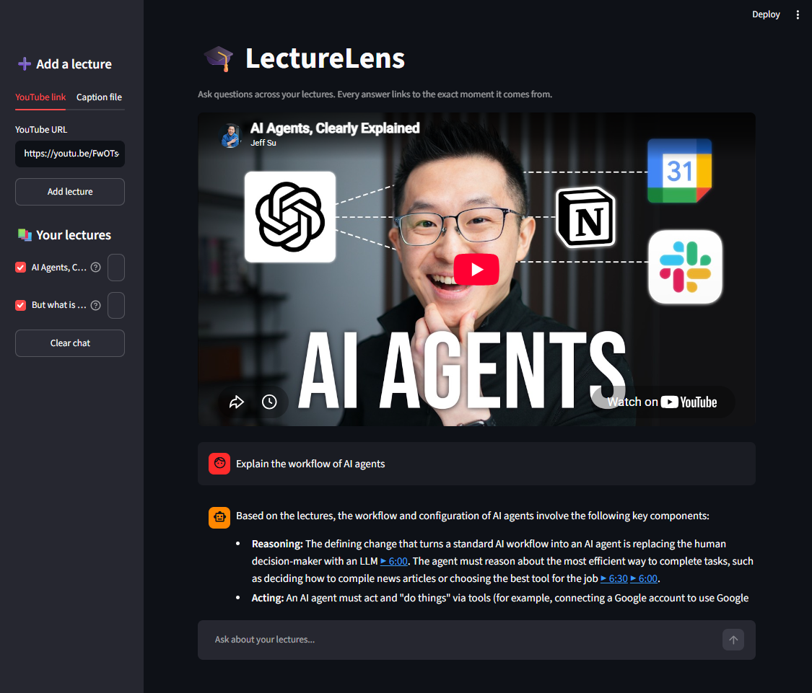
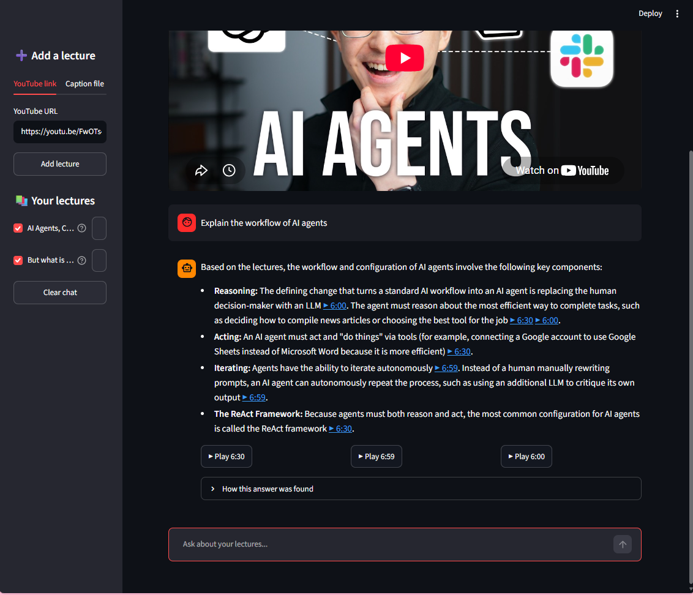
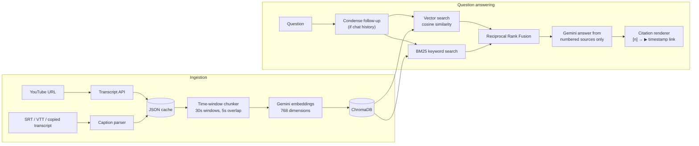

# 🎓 LectureLens

**Ask questions across hours of YouTube lectures and get grounded answers with clickable timestamp citations that jump to the exact moment in the video.**

[](https://github.com/Bhukya-jashwanthi/lecturelens/actions/workflows/tests.yml)


<table>
  <tr>
    <td width="50%"></td>
    <td width="50%"></td>
  </tr>
  <tr>
    <td align="center"><em>Embedded player jumps to the cited moment</em></td>
    <td align="center"><em>Every point cites its timestamp</em></td>
  </tr>
</table>

> *"Explain the workflow of AI agents"* → an answer drawn only from the indexed lectures, where every point cites the moment it comes from (**▶ 6:00**, **▶ 6:30**, **▶ 6:59**). Clicking a citation or a ▶ Play button plays the video from that moment.

---

## Why

Recorded lectures are long, and finding *where* something was explained means scrubbing through the timeline. LectureLens indexes lecture transcripts and answers questions with **retrieval-augmented generation (RAG)**. It retrieves the relevant moments, answers only from them, and links every claim back to its timestamp. If the lectures don't cover a question, it says so instead of guessing.

## Features

- **Add lectures** from a YouTube link, or import captions (`.srt`, `.vtt`, or text copied from YouTube's *Show transcript* panel). Imported captions also cover Zoom, Teams and Google Meet recordings.
- **Hybrid retrieval:** semantic vector search plus BM25 keyword search, merged with Reciprocal Rank Fusion.
- **Grounded answers with citations:** the model cites numbered sources; code turns them into timestamp links and drops invented ones.
- **Refuses out-of-scope questions** with a fixed sentence instead of answering from general knowledge.
- **Follow-up questions:** "explain *that* more simply" is rewritten into a standalone query before searching.
- **Embedded player:** citations and ▶ Play buttons jump the video to the cited moment.
- **Transparent retrieval:** each answer shows which chunks were used and how they ranked in each search method.
- **Measured quality:** a labelled evaluation set reports hit rate and MRR (see [Evaluation](#evaluation)).

## How it works



1. **Ingest:** transcripts arrive as ~3-second fragments with start times. They are cached as JSON, so YouTube is contacted once per video.
2. **Chunk by time, not characters:** fragments are merged into overlapping 30-second windows. Each chunk keeps an exact start time, which becomes its citation link.
3. **Embed and store:** chunks are embedded with `gemini-embedding-2` (truncated to 768 dimensions) and stored in ChromaDB with their video ID and timestamps.
4. **Retrieve:** the question runs through both vector search (meaning) and BM25 (exact terms such as names, numbers and acronyms). Reciprocal Rank Fusion merges the two rankings.
5. **Answer:** Gemini receives the top 5 chunks as numbered sources and a strict grounding prompt. Code converts `[2]` citations into timestamp links.

## Evaluation

Retrieval was evaluated on **24 hand-labelled questions** about one lecture, each with the time range where the answer is spoken. A hit means a retrieved chunk overlaps that range. Full results are in [`eval/results.md`](eval/results.md).

| Chunks (window / overlap) | Method | Hit@1 | Hit@5 | MRR@5 |
|---|---|---|---|---|
| **30s / 5s** | **Hybrid (RRF)** | **83%** | **100%** | **0.90** |
| 30s / 5s | Semantic only | 71% | 100% | 0.82 |
| 30s / 5s | BM25 only | 75% | 96% | 0.83 |
| 60s / 15s | Hybrid (RRF) | 62% | 96% | 0.77 |
| 120s / 30s | Hybrid (RRF) | 67% | 100% | 0.80 |

**Answer grounding:** all **6/6** out-of-scope questions (e.g. "How does backpropagation compute the gradient?", which the lecture only mentions) were correctly refused, and **6/6** sampled in-scope questions were answered.

Hybrid search over 30-second chunks put the right moment first most often, so it is the default. The test set is small (one question ≈ 4%), so only the larger gaps are meaningful.

```bash
python eval/evaluate.py --answers
```

## Tech stack

| Area | Tools |
|---|---|
| LLM and embeddings | Google Gemini (`gemini-3.5-flash-lite`, `gemini-embedding-2`) via `langchain-google-genai` |
| Orchestration | LangChain (LCEL chains, `BaseRetriever`) |
| Vector store | ChromaDB (HNSW index, cosine distance) |
| Keyword search | `rank-bm25` |
| Data | `youtube-transcript-api`, custom SRT/VTT/transcript-panel parser |
| UI | Streamlit |
| Config and quality | `pydantic-settings`, pytest (78 tests), GitHub Actions |

## Project structure

```
lecturelens/
├── app.py                    # Streamlit UI
├── src/lecturelens/
│   ├── config.py             # typed settings from .env
│   ├── models.py             # Segment, Transcript, Chunk
│   ├── transcript.py         # YouTube fetch + caption import, JSON cache
│   ├── subtitles.py          # SRT / VTT / transcript-panel parser
│   ├── chunking.py           # overlapping time-window chunks
│   ├── vectorstore.py        # Gemini embeddings + ChromaDB
│   ├── retriever.py          # BM25, hybrid search, Reciprocal Rank Fusion
│   ├── prompts.py            # grounding and query-condensing prompts
│   ├── rag_chain.py          # retrieve → answer → render citations
│   ├── evaluation.py         # hit rate and MRR
│   └── retry.py              # retries for transient API errors
├── eval/                     # labelled questions, evaluation script, results
└── tests/                    # unit tests (offline: fake LLM and embeddings)
```

## Getting started

**Prerequisites:** Python 3.11+ and a free [Gemini API key](https://aistudio.google.com/apikey).

```bash
git clone https://github.com/Bhukya-jashwanthi/lecturelens.git
cd lecturelens
python -m venv .venv
.venv\Scripts\activate          # macOS/Linux: source .venv/bin/activate
pip install -r requirements.txt -e .
cp .env.example .env            # then put your key in .env
```

**Run the app:**

```bash
streamlit run app.py
```

Add a lecture from the sidebar, then ask questions in the chat.

**Command-line tools** (each module also runs on its own):

```bash
python -m lecturelens.transcript https://www.youtube.com/watch?v=aircAruvnKk   # fetch + cache a transcript
python -m lecturelens.transcript lecture.vtt                                   # import a caption file
python -m lecturelens.vectorstore index aircAruvnKk                            # chunk, embed and store
python -m lecturelens.retriever "what is the bias used for"                     # compare search methods
python -m lecturelens.rag_chain                                                 # chat in the terminal
```

**Tests:**

```bash
pytest
```

The tests use a fake LLM and fake embeddings, so they run offline in seconds without an API key.

## Design decisions

| Decision | Reason |
|---|---|
| Chunk by **time** instead of characters | Every chunk has an exact start time, which makes timestamp citations possible. |
| **30s** windows with 5s overlap | Chosen by evaluation: MRR 0.90 vs 0.77 for 60s windows. Overlap keeps ideas spoken across a boundary intact. |
| **Hybrid** retrieval with RRF | Semantic search handles paraphrases and terms never spoken (e.g. "MNIST"). BM25 handles names and numbers (e.g. "Lisha Li", "13,000"). RRF combines rankings whose scores are on different scales. |
| The LLM cites **numbers**; code builds links | LLMs invent plausible timestamps and URLs. Building links in code guarantees each one points to a retrieved chunk. |
| Fixed **"not covered"** sentence | Code can reliably detect refusals and mark answers as ungrounded. |
| **768-dim** embeddings | Gemini embeddings can be truncated (Matryoshka). In a small spot check, rankings matched the full 3,072 dimensions, at a quarter of the storage. |
| Collection named after the **embedding model** | Vectors from different models aren't comparable, so switching models starts a fresh index instead of silently mixing them. |
| **Caption import** in addition to YouTube | YouTube blocks automated transcript requests from some networks. Caption files keep the app usable and add support for meeting recordings. |
| Retries **honour `retryDelay`** | The free tier enforces per-minute quotas. Waiting the time the server asks avoids failing on a short limit, and long waits (daily quota) fail fast. |
| `gemini-3.5-flash-lite` for answers | Answering from 5 short sources doesn't need a large model. It responds in about a second, avoids `gemini-3.8-flash`'s free-tier limit of 20 requests per day, and passed the grounding evaluation. |

## Limitations

- English transcripts only.
- YouTube may block transcript requests from some networks; use caption import in that case.
- The evaluation set covers one lecture with 24 questions.
- The Gemini free tier has daily request limits.
- Chapter headings in copied YouTube transcripts are merged into the preceding line.

## Future improvements

- Show YouTube chapter titles next to citations.
- Cross-encoder reranking of the fused results.
- Stream answers token by token in the UI.
- Multilingual transcripts and embeddings.
- A larger evaluation set across several lectures, including answer-quality scoring.

## License

[MIT](LICENSE)
